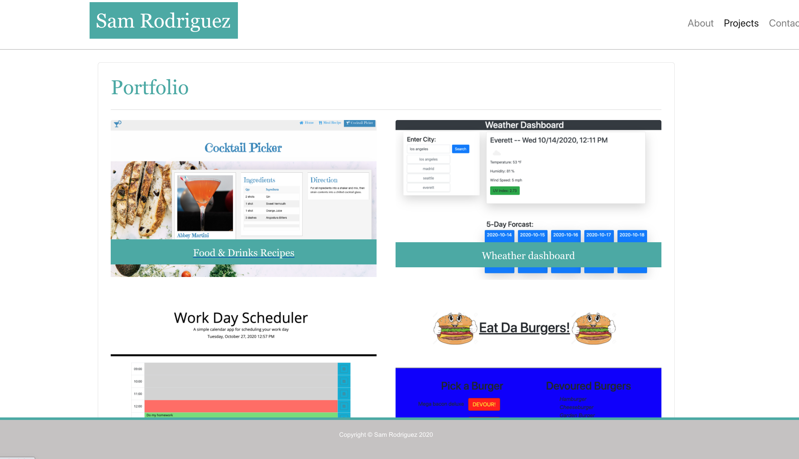

# Sam-Rodriguez-Portfolio

INTRUDUCTION

This is my portfolio, it shows some of the projects I have worked on so far.

USER INTERFACE

The user is presented is presented with an "about me" page, wich gives a brief intruduction of me.  It also show github and linkedin links to the correspoding profiles on those websites.
The navbar on the upper right hand corner has links to the portfolio page and contace-me page.

USER STEPS

1.  Read about me page
2.  Click on the Portfolio link to view some of my projects
3.  Connect with me via Linkedin and Gibhub by clicking on the links at the bottom of each page

APPLICATION URLs:

Deployed application:  https://samrod777.github.io/Sam-Rodriguez-React-Portfolio/

GitHub repository URL: https://github.com/samrod777/Sam-Rodriguez-React-Portfolio

© 2020 Sam Rodriguez. All Rights Reserved.

